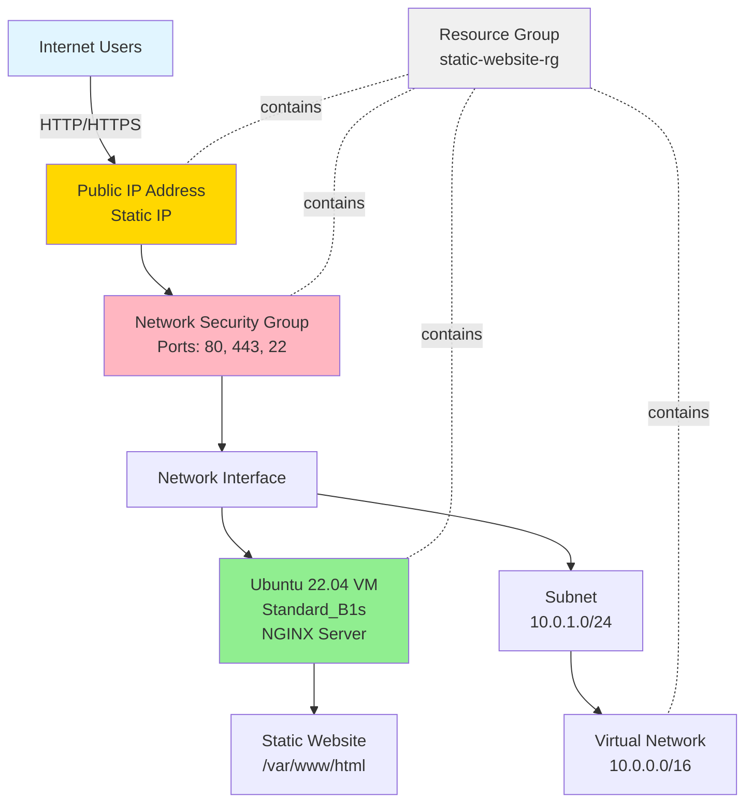

# Azure Static Website Deployment 🚀

[](https://azure.microsoft.com)
[](https://ubuntu.com)
[](https://nginx.org)
[](https://github.com/features/actions)

A fully automated Azure infrastructure deployment for hosting static websites using Infrastructure as Code (IaC) principles. This project demonstrates professional cloud engineering practices with complete automation, security best practices, and CI/CD integration.

## 📋 Table of Contents

- [Overview](#overview)
- [Architecture](#architecture)
- [Features](#features)
- [Prerequisites](#prerequisites)
- [Quick Start](#quick-start)
- [Detailed Setup](#detailed-setup)
- [Configuration](#configuration)
- [GitHub Actions CI/CD](#github-actions-cicd)
- [Troubleshooting](#troubleshooting)
- [Cost Estimation](#cost-estimation)
- [Cleanup](#cleanup)
- [Screenshots](#screenshots)
- [Contributing](#contributing)
- [License](#license)

## 🎯 Overview

This project automates the deployment of a static website on Microsoft Azure using:

- **Azure CLI** for infrastructure provisioning
- **Bash scripts** for complete automation
- **NGINX** web server on Ubuntu 22.04 LTS
- **Cloud-init** for automated VM configuration
- **GitHub Actions** for CI/CD pipeline

### What Gets Deployed

- ☁️ Azure Resource Group
- 🌐 Virtual Network with subnet segmentation
- 🔒 Network Security Group with firewall rules
- 🖥️ Linux Virtual Machine (Ubuntu 22.04)
- 📡 Static Public IP Address
- 🔌 Network Interface
- 🌍 NGINX web server with your static website

## 🏗️ Architecture

```
Internet
    ↓
Public IP (Static)
    ↓
Network Security Group (Firewall)
    ├── Port 80 (HTTP)
    ├── Port 443 (HTTPS)
    └── Port 22 (SSH)
    ↓
Network Interface
    ↓
Virtual Network (10.0.0.0/16)
    └── Subnet (10.0.1.0/24)
        ↓
    Ubuntu VM (Standard_B1s)
        └── NGINX Web Server
            └── Static Website (/var/www/html)
```

### Architecture Diagram



## ✨ Features

### 🔧 Infrastructure as Code

- 100% automated deployment using Azure CLI
- No manual Azure Portal clicks required
- Reproducible infrastructure

### 🔒 Security Best Practices

- SSH key-based authentication (no passwords)
- Network Security Groups with minimal required ports
- UFW firewall configured on VM
- Security headers configured in NGINX

### 🚀 Performance Optimized

- Gzip compression enabled
- Static file caching configured
- Optimized NGINX configuration

### 💰 Cost Efficient

- Uses cost-effective B-series VMs
- Estimated cost: ~$12-15/month
- Easy resource cleanup to avoid charges

### 📚 Well Documented

- Comprehensive README with examples
- Inline code comments
- Architecture diagrams
- Troubleshooting guide

### 🔄 CI/CD Ready

- GitHub Actions workflow included
- Automated deployment on push
- Testing and verification steps

## 📦 Prerequisites

### Required Tools

1. **Azure CLI** (version 2.50.0 or later)

```bash
# Install on Ubuntu/Debian
curl -sL https://aka.ms/InstallAzureCLIDeb | sudo bash

# Install on macOS
brew install azure-cli

# Verify installation
az --version
```

2. **Git**

```bash
# Ubuntu/Debian
sudo apt-get install git -y

# macOS
brew install git
```

3. **SSH** (usually pre-installed on Linux/macOS)

### Azure Requirements

- Active Azure subscription
- Contributor or Owner role on the subscription
- Sufficient quota for:
  - 1 VM (Standard_B1s)
  - 1 Public IP
  - 1 VNet

### Local Setup

```bash
# Clone this repository
git clone https://github.com/yourusername/azure-static-website.git
cd azure-static-website

# Make scripts executable
chmod +x scripts/*.sh
```

## 🚀 Quick Start

### Option 1: One-Command Deployment

```bash
# Run the master deployment script
./scripts/deploy.sh
```

That's it! The script will:

1. ✅ Check prerequisites
2. ✅ Login to Azure (if needed)
3. ✅ Generate SSH keys
4. ✅ Create all Azure resources
5. ✅ Deploy the website
6. ✅ Test accessibility

### Option 2: Step-by-Step Deployment

```bash
# 1. Setup environment
./scripts/setup-environment.sh

# 2. Create resource group
./scripts/create-resource-group.sh

# 3. Create networking
./scripts/create-network.sh
./scripts/create-nsg.sh
./scripts/create-public-ip.sh
./scripts/create-nic.sh

# 4. Create VM
./scripts/create-vm.sh

# 5. Wait for VM initialization (2-3 minutes)
# Then deploy your custom website
./scripts/deploy-website.sh
```

## 📖 Detailed Setup

### Step 1: Azure Authentication

```bash
# Login to Azure
az login

# List subscriptions
az account list --output table

# Set active subscription
az account set --subscription "YOUR_SUBSCRIPTION_ID"

# Verify
az account show --output table
```

### Step 2: Configure Variables

Edit `config/variables.sh` to customize your deployment:

```bash
# Resource naming
export RESOURCE_GROUP="static-website-rg"
export LOCATION="eastus"
export VM_NAME="website-vm"
export VM_SIZE="Standard_B1s"

# Network configuration
export VNET_NAME="website-vnet"
export VNET_PREFIX="10.0.0.0/16"
export SUBNET_NAME="website-subnet"
export SUBNET_PREFIX="10.0.1.0/24"

# Admin configuration
export ADMIN_USERNAME="azureuser"
export SSH_KEY_PATH="$HOME/.ssh/azure_website_key"
```

### Step 3: Deploy Infrastructure

```bash
# Source variables
source config/variables.sh

# Run deployment
./scripts/deploy.sh
```

### Step 4: Customize Website

Replace the contents of the `website/` directory with your own static files:

```
website/
├── index.html          # Your main HTML file
├── css/
│   └── style.css       # Your stylesheets
├── js/
│   └── script.js       # Your JavaScript
└── assets/
    ├── images/         # Your images
    └── fonts/          # Your fonts
```

### Step 5: Deploy Website

```bash
# Deploy your custom website
./scripts/deploy-website.sh
```

## ⚙️ Configuration

### Environment Variables

| Variable         | Default             | Description                |
| ---------------- | ------------------- | -------------------------- |
| `RESOURCE_GROUP` | `static-website-rg` | Azure resource group name  |
| `LOCATION`       | `uksouth`            | Azure region               |
| `VM_SIZE`        | `Standard_B1s`      | VM size (1 vCPU, 1 GB RAM) |
| `ADMIN_USERNAME` | `azureuser`         | SSH username               |
| `VNET_PREFIX`    | `10.0.0.0/16`       | Virtual network CIDR       |
| `SUBNET_PREFIX`  | `10.0.1.0/24`       | Subnet CIDR                |

### NGINX Configuration

The default NGINX configuration (`/etc/nginx/sites-available/default`) includes:

- Document root: `/var/www/html`
- Gzip compression enabled
- Static file caching (30 days)
- Security headers
- HTTP/2 support (when HTTPS configured)

To customize:
